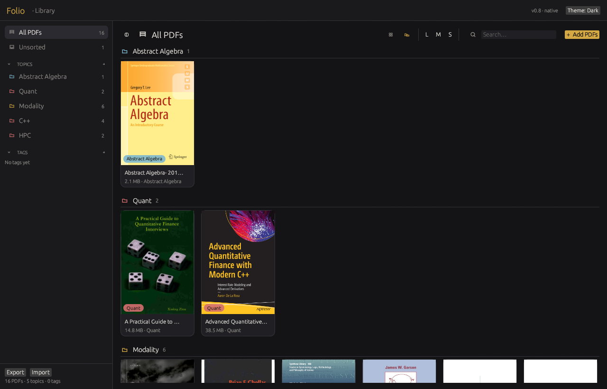
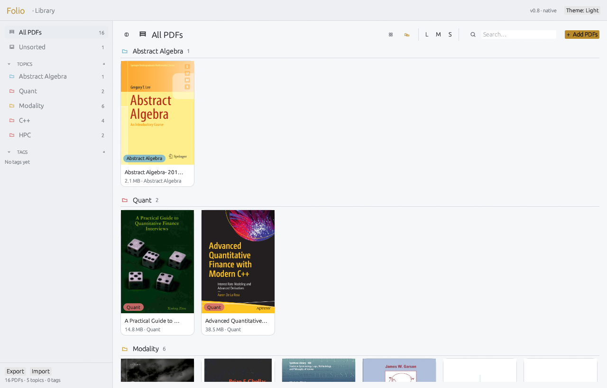
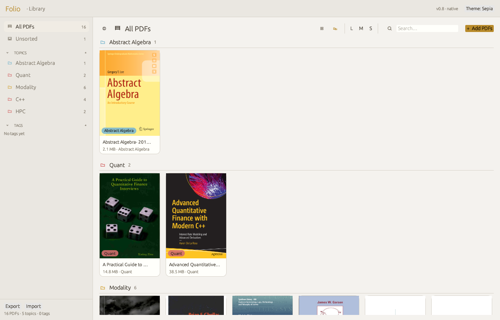

# Folio

Folio is a PDF reader and library manager written in Rust. It targets Linux and Windows.

The application is built with egui/eframe for the interface and pdfium-render for PDF handling. Rendering, text extraction, thumbnail generation and search are performed entirely in-process.

## Features

The library view presents a grid of PDF covers. Covers are rendered on a background thread and cached on disk so that subsequent launches remain responsive.

Documents may be organised under one or more topics (colour-coded and shown in the sidebar) and any number of tags. Both topics and tags support filtering, and the library can be shown flat or grouped by topic.

The reader performs lazy per-page rendering and supports zoom, navigation and continuous scrolling. Unused page textures are released to limit memory consumption.

Text can be selected directly on the page and copied. Highlights in five colours are stored as normalised page coordinates and remain correctly aligned at any zoom level. Highlights may be removed by clicking them.

The complete library state (topics, tags, document entries and highlights) can be exported or imported as a single JSON file. Persistent data is stored in the platform application data directory as `folio-data.json`.

## Screenshots

The library view groups PDF covers by topic, with topics and tags in the sidebar:

The reader offers a table-of-contents panel, page navigation, zoom and five highlight colours:

### Themes

Folio ships three themes — dark, light and sepia:

| Dark | Light | Sepia |
|:----:|:-----:|:-----:|
|  |  |  |

## Download

Pre-built binaries are available from the [Releases](https://github.com/HanielUlises/folio/releases) page.

- **Linux** (`folio-linux-x86_64.tar.gz`): extract and run the `folio` executable.
- **Windows** (`folio.exe`): download and run it directly — no installation, no separate files.

The pdfium library is embedded in the executable and extracted to a per-user cache directory on first run, so nothing needs to be kept alongside it.

## Requirements

- Rust 1.97.1 (specified in `rust-toolchain.toml`)
- A working OpenGL implementation (on Linux: X11 or Wayland)
- The pdfium shared library — `libpdfium.so` on Linux, `pdfium.dll` on Windows. This is **embedded into the release executables** by `build.rs`, so pre-built binaries need nothing extra. When building from source, the library is taken from `src-tauri/pdfium/` (a Linux copy is vendored there; set `FOLIO_PDFIUM_EMBED` to point elsewhere, e.g. to supply `pdfium.dll` on Windows).

At runtime the application searches for the pdfium library in the following order: `$FOLIO_PDFIUM_DIR`, the embedded copy extracted to the per-user cache directory, the directory containing the executable (including a `pdfium/` subdirectory), the vendored copy under `src-tauri/pdfium/`, and finally the system library path.